# Architecture

On this page, let's dive deeper about the architecture design and implementations.

## Principals

Remember the challenges about agentic applications in production in the landing page? To address these challenges, we need to design a new runtime framework. I took a lot of time thinking about principles and guidelines about how the architecture should be designed. 

Let's list a few questions:

* Should this runtime system be bundled with application frameworks? If not, what experience we would like to offer to developers with existing frameworks like LangChain, Google ADK?
* What programing languages should be used to develop such runtime frameworks?
* What programing languages should be supported by such runtime frameworks for agent development?
* What's the boundary of such runtime frameworks? Should it cover the management of all aspect of an agentic application?
* ...

It's quite difficult to have correct answers to all these questions. As agentic applications are evolving rapidly both in academic research and industry practice. People constantly come up with new ideas about what agents can be done, and how agents can be implemented. For example, before `OpenAI` introduces computer-use tools, we would think about agent tools short-lived computation tasks. And in recent days, agentic applications go beyond desktop and cloud. We can even find many attempts of agentic applications in robotics system using VLM and VLA models.

In the end, I would like carry out some opinionated guidelines that to narrow down problem set of `tuna-fusion` and make the project more agile to run. Primary guidelines are following:

* `tuna-fusion` focus on LLM-driven agentic applications for general purpose on the cloud.
* Agent frameworks agostic: `tuna-fusion` won't care about how developers write the code as long as they can export the implementation using `AgentExecutor` adaptor layer from [A2A Library](https://github.com/a2aproject/a2a-python). By leveraging A2A protocol, we also gain the semantics of sessions and tasks, `tuna-fusion` will take care of these runtime data. 
* Java and Python as first-class languages: `tuna-fusion` should support Java and Python as first-class languages both for developing `tuna-fusion` itself and developing agentic applications deployed to `tuna-fusion`.
* `MCP` for connecting the ecosystem: `tuna-fusion` introduces the adapters to use exiting MCP server packages and the workflows to develop one from scratch. Nowadays, people connect classical agent tools, like web search and data interpreters, as well as memory system, to agent applications using MCP protocol. I think it's an obvious trend to replace vendor-specific integrations with MCP server implementations. 

## The Diagrams

### System context diagram

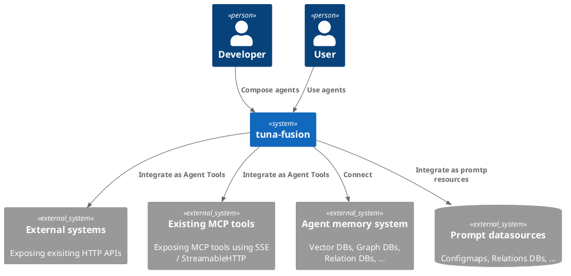

### Container diagram

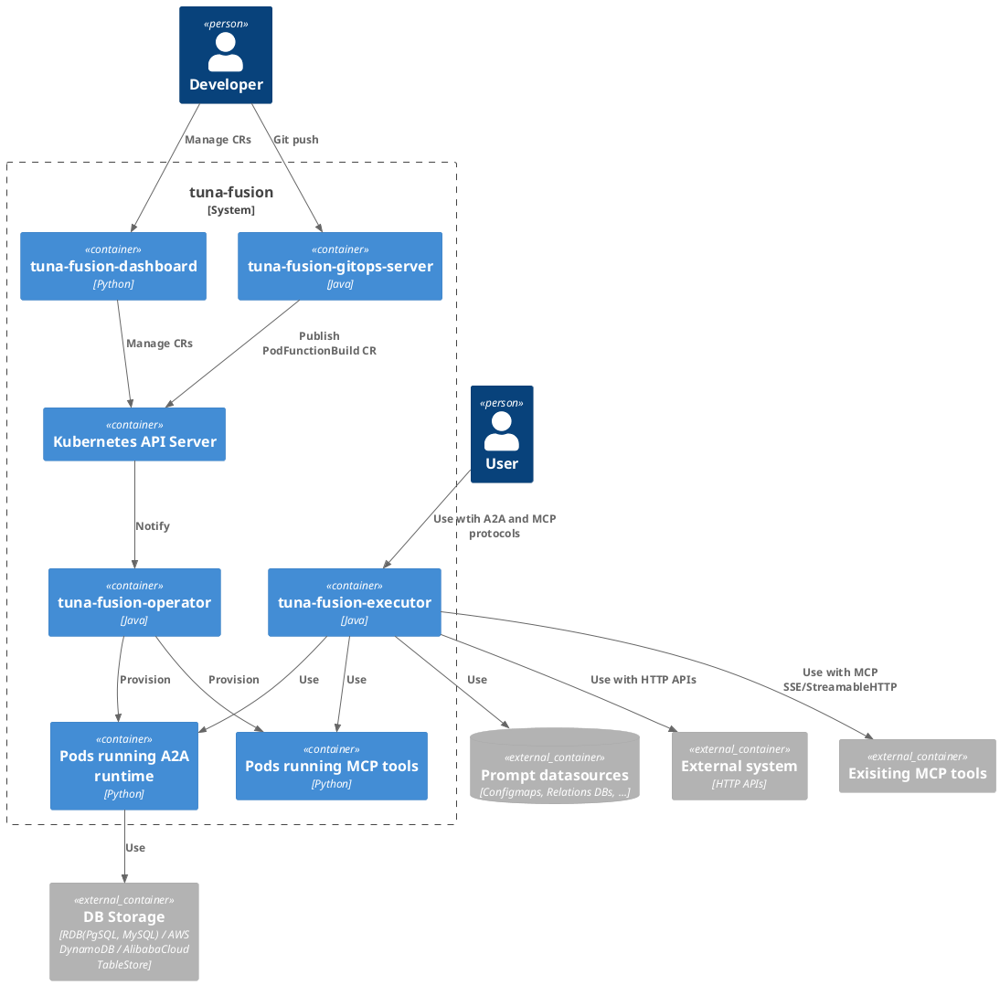

### Component diagram

#### `tuna-fusion-operator`

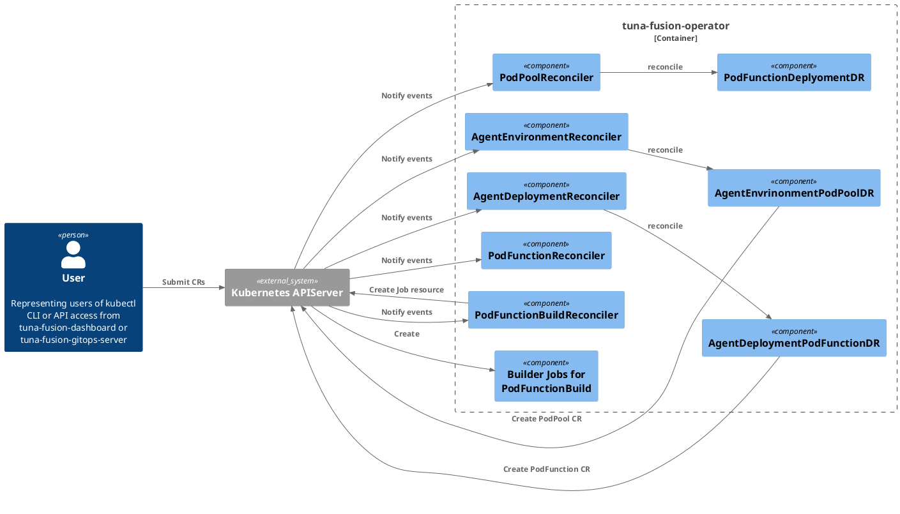

In `tuna-fusion-operator`, we employ the [operator pattern](https://kubernetes.io/docs/concepts/extend-kubernetes/operator/) to manage lifecycle of all kinds of resources. This brings two kinds of important components: `Reconciler` and `DepedentResource`. These two actors come from [Operator frameworks SDK](https://github.com/operator-framework) which is common choice to implement real world operators.

You can learn more about these concepts from here:

* [JOSDK - DependentResource](https://javaoperatorsdk.io/docs/documentation/dependent-resource-and-workflows/dependent-resources/)
* [Tutorial from GO Operator SDK](https://sdk.operatorframework.io/docs/building-operators/golang/tutorial/)

The goals of these components are to:

1. Create, update or delete (if necessary) Kubernetes core resources like Pods, Services, ConfigMaps, Secrets, etc using events from informer APIs.
2. Provide simplified API interface to users. That's user won't care about how the high-level resources like `AgentDeployment`s are handled. They just submit and wait for reconciliation to finish.  

#### `tuna-fusion-executor`

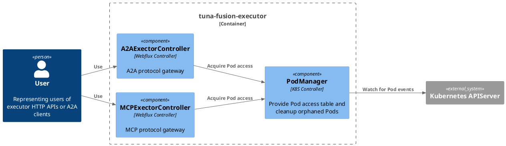

`tuna-fusion-executor` is the access layer of workload components like `AgentDeploymnet` and `MCPServer`. And it's the gateway server that exposes both MCP and A2A protocols. The gateway pattern allows us to dynamic choose destination Pods based on resource availability and translate bi-directionally between protocols.

Behind the gateway server, it connects to a selected Pod using appropriate protocol. For example, if you are accessing the A2A endpoint, it will forward A2A JSON-RPC requests.

In the Pods for agents and tools, some frameworks code bridges the user provided logics (in commited source code) and incoming JSON-RPC requests. These frameworks code will be published as a standalone package, but at present it's built into runtime image directly. See source codes at `fission-a2a-env/fastapi-runtime` for more details.

#### `tuna-fusion-gitops-server`

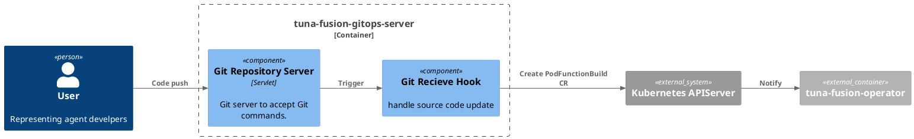

`tuna-fusion-gitops-server` is a virtual Git server for source code deployment. The internal CI pipeline will be triggered to build source code and deploy to a Kubernetes cluster. This saves effort to create complex resources for each build. 

!!! info

    Technically speaking, `tuna-fusion-gitops-server` is an optional sub-system. You can always submit your `PodFunctionBuild` CR to trigger CI pipeline. 

## The Implementations

### Custom resources

| CRD               	        | Description                                                             | State diagram                                             |
|----------------------------|-------------------------------------------------------------------------|-----------------------------------------------------------|
| AgentEnvironment	          | Define how agents should be built and deployed                          | N/A                                                       |                       |                                                                  |                                                         |
| AgentDeployment		          | Define `AgentCard` and other properties of a single agent               | N/A                                                       |
| PodPool	                   | Defines how a group of Pods should be pooled                            | N/A                                                       |
| PodFunction		              | Defines the actual implementation of business units called `Function`s. | N/A                                                       |
| PodFunctionBuild			        | Define the properties of single build                                   | 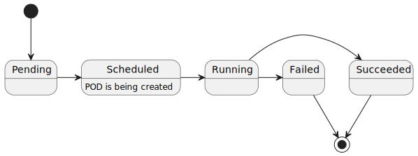 |
| MCPServer (WIP)            | Defines how should the given MCP server implementations be deployed     | 											                                               |

### Reconciliation

#### AgentEnvironment reconciliation

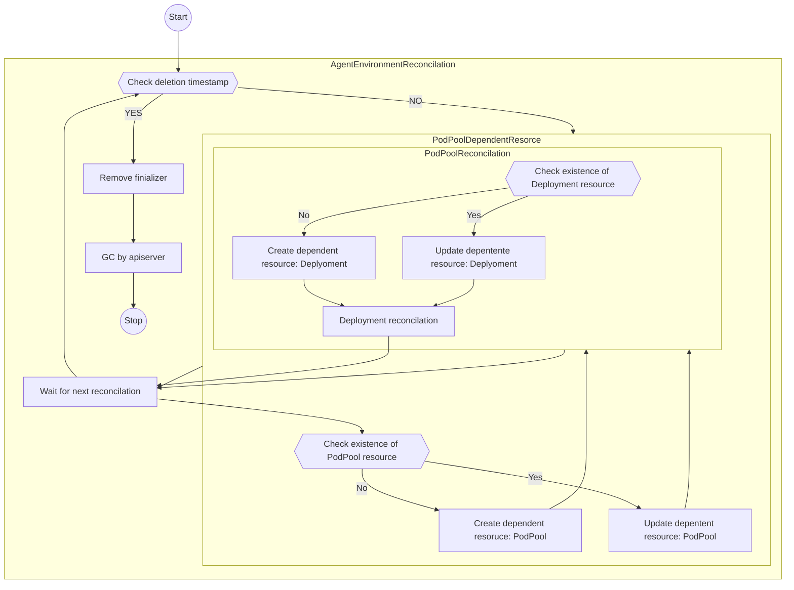

#### AgentDeployment reconciliation

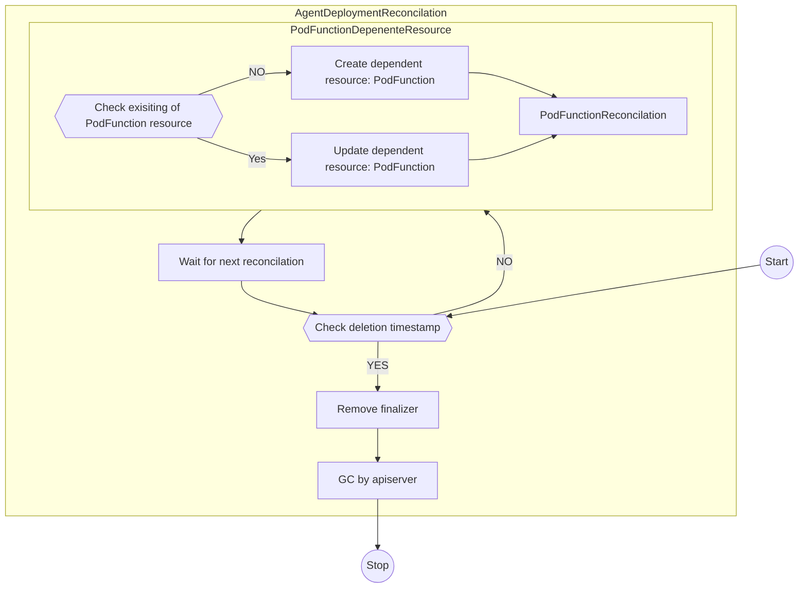

#### PodFunctionBuild reconciliation

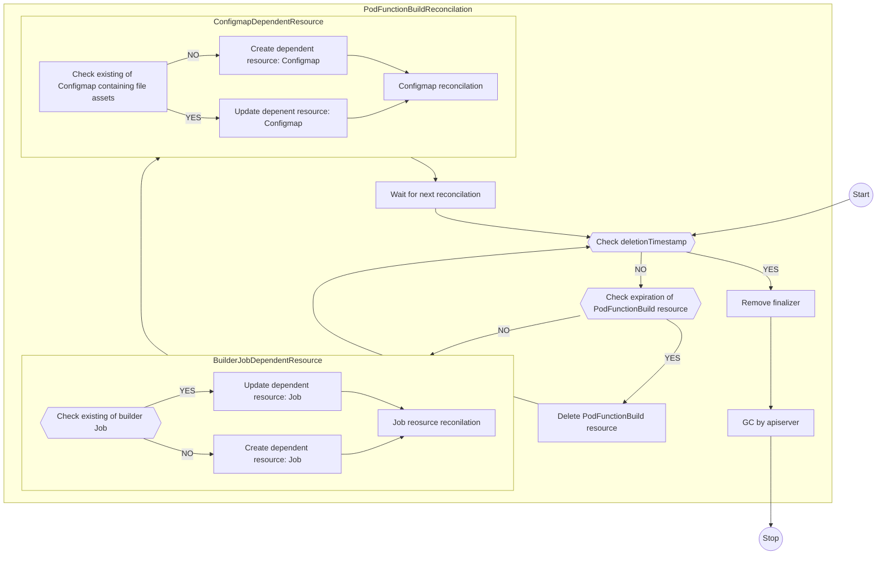

### Builder Job Pod design

Builder job is created during PodFunctionBuild reconciliation. It's responsible to run builder image where source code archive (`SourceArchive`) submitted by user in `PodFunctionBuild` resource is transformed into consumable artifacts by runtime image, aka `DeployArchive`.

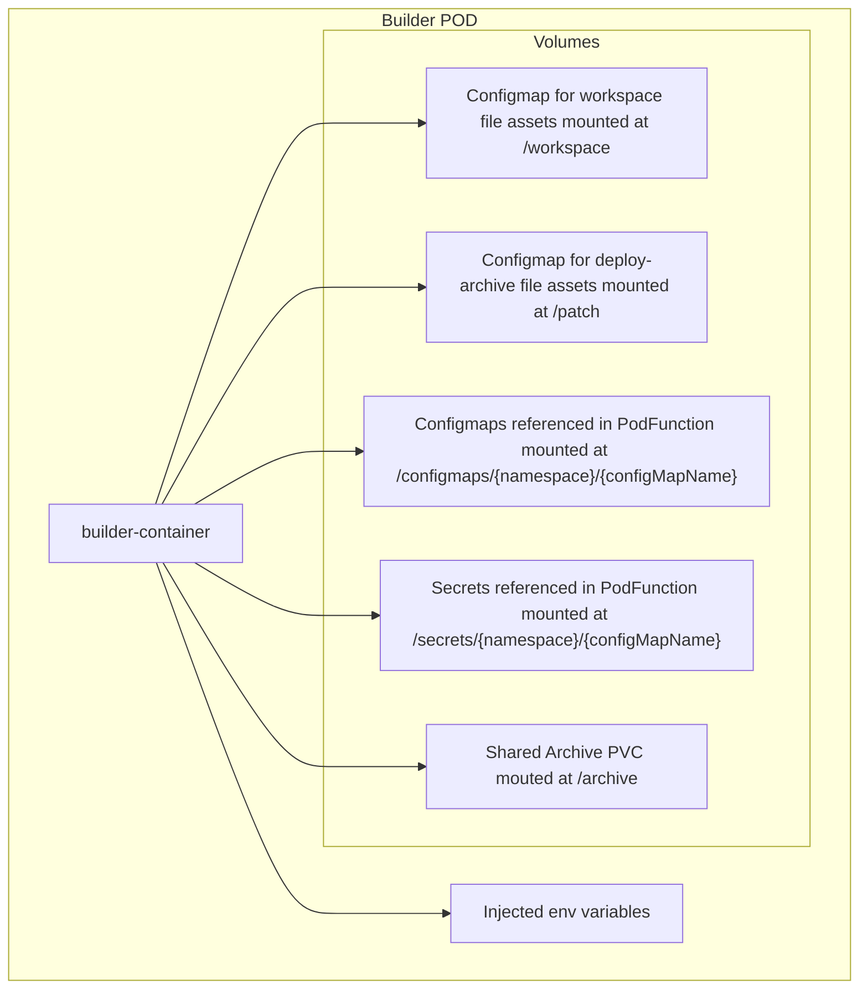

### GitOps workflow for CI build

`tuna-fusion` has different workflows for different resources. The following sequence chart depicts how a `PodFunctionBuild` resource is handled in the system. Recipes of other resources are similar.  

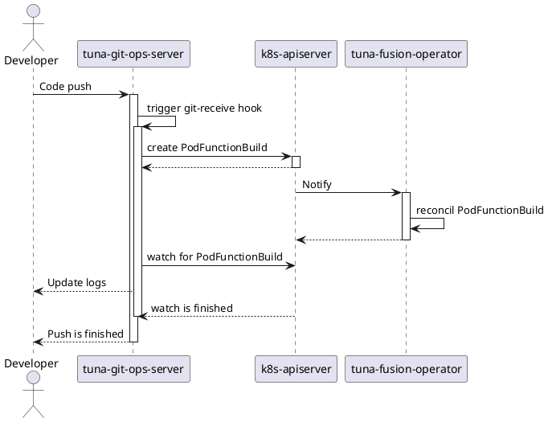

