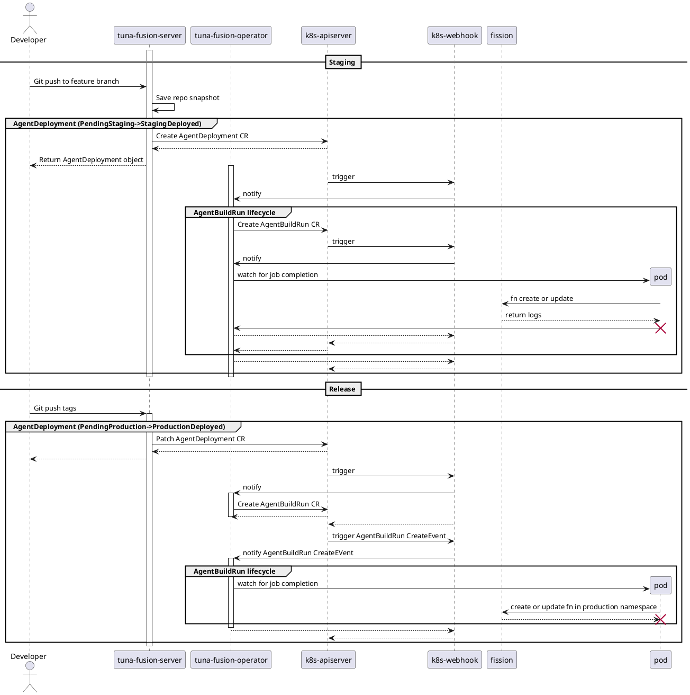
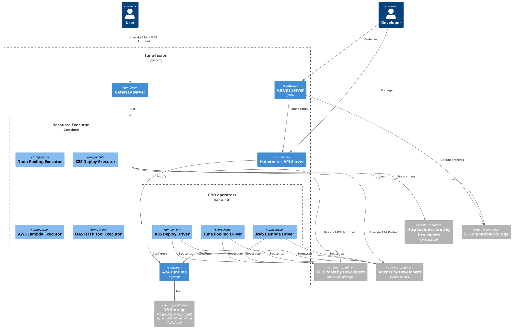
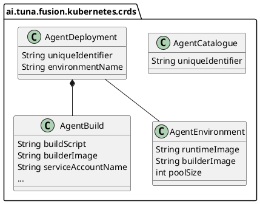

# Architecture
To understand how `tuna-fusion` work, some fundamental design patterns are introduced:

* Operator pattern in `Kubernetes`
* Gateway pattern

## Custom resources

| CRD               	| Usage                                          | State diagram                                     |
|-----------------------|------------------------------------------------|---------------------------------------------------|
| AgentDeployment		| Manages lifecycle for agent repository         |  |
| AgentBuild			| Manages a single build run of agent repository |  |
| MCPServerDeployment	| Manages a lifecycle for MCP server             |                                                   |
| MCPServerBuild		| Manages a single build run of MCP server       |                                                   |
| HTTPToolDeplyoment	|                                                |                                                   |
| AgentResourceBinding	| Manages relationships between a single agent and other resources | 											                                       |
| AgentMemory			| Manages agent memory resource					 | 															                                   | 

## Workflow

* Admission control
    * For `AgentDeployment`, check data integrity
    * For `AgentBuild`:
        * check data integrity
        * check `ownerReferences` is properly set, and referenced `AgentDeplyoment` actually exists.
        * check `currentBuilds[buildTarget]` of `AgentDeployment`
* Timer loop for pending `AgentBuild`:
    * Fetch `AgentDeployment` via `ownerRefernecees`
    * Create `Job` as child resource, with time limit.
    * Update `phase` to `scheduled`
* Timer loop for non-terminal `AgentBuild`
    * Fetch related `Job`
    * Check job state:
        * if `Job` is `active` or `ready`, update `phase` of current `AgentBuild` to `running`
        * if `Job` is `failed`, update `phase` of current `AgentBuild` to `failed`
        * if `Job` is `succeeded`, update `phase` of current `AgentBuild` to `succeeded`
* Field event handler of `phase` of `AgentBuild`
    * If `phase` is terminal state, update `currentBuilds[buildTarget]` to `None`

## Pipeline

## Component Diagram

## Domain models

