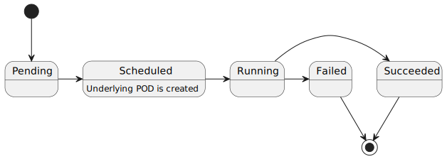

# GitOps Architecture

## Custom resources

| CRD             | State diagram                                             |
|-----------------|-----------------------------------------------------------|
| AgentDeployment |  |
| AgentBuildRun   |      |

## Workflow

* Admission control
  * For `AgentDeployment`, check data integrity
  * For `AgentBuild`:
    * check data integrity
    * check `ownerReferences` is properly set, and referenced `AgentDeplyoment` actually exists.
    * check `currentBuilds[buildTarget]` of `AgentDeployment`
* Timer loop for pending `AgentBuild`:
  * Fetch `AgentDeployment` via `ownerRefernecees`
  * Create `Job` as child resource, with time limit.
  * Update `phase` to `scheduled`
* Timer loop for non-terminal `AgentBuild`
  * Fetch related `Job`
  * Check job state:
    * if `Job` is `active` or `ready`, update `phase` of current `AgentBuild` to `running`
    * if `Job` is `failed`, update `phase` of current `AgentBuild` to `failed`
    * if `Job` is `succeeded`, update `phase` of current `AgentBuild` to `succeeded`
* Field event handler of `phase` of `AgentBuild`
  * If `phase` is terminal state, update `currentBuilds[buildTarget]` to `None` 

## Pipeline

