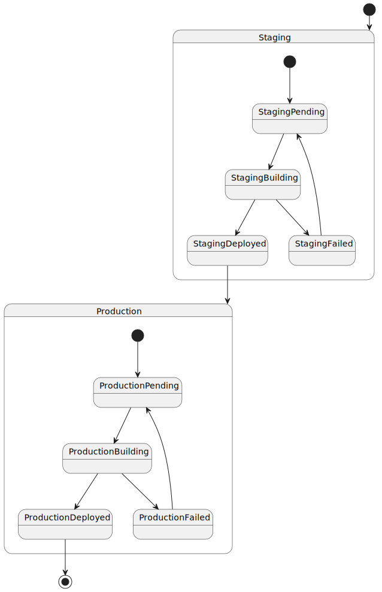
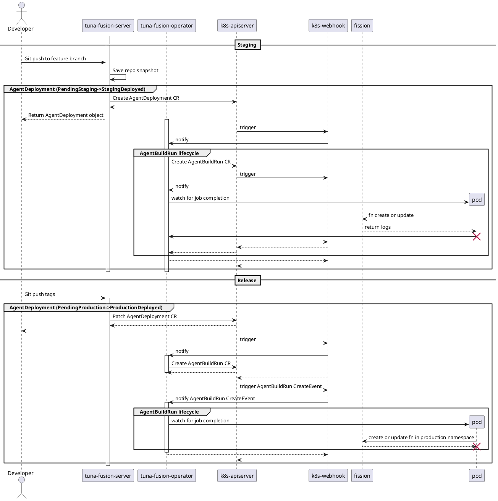

# GitOps Architecture

## Custom resources

| CRD             | State diagram                                             |
|-----------------|-----------------------------------------------------------|
| AgentDeployment |  |
| AgentBuildRun   |      |

## Pipeline

