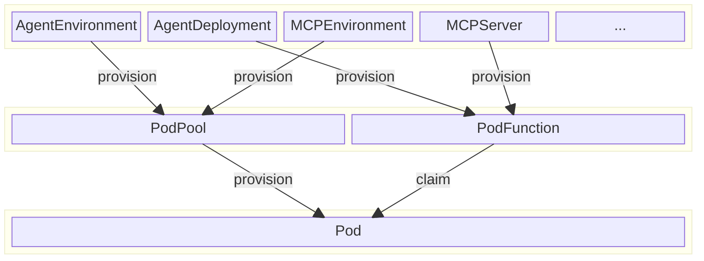

# tuna-fusion

`tuna-fusion` is an open-source, cloud-native agent runtime framework.

## Why `tuna-fusion` matters

* **Multi-agent deployment**: In practice, multiple agents are often deployed to fulfill complex tasks. Unlike traditional web applications where different routes decompose a large application, each standalone agent represents the smallest functional unit. Deploying multiple agents introduces challenges such as build inefficiency, deployment complexity, and resource management.

* **Session isolation**: Agent execution can involve risky operations like autonomous code evaluation and file system access. A robust agent runtime must ensure session-level isolation to prevent one agent from affecting another's resources.

* **Vertical integrations**: Agents rely on various components including MCP tools, vector databases, and prompt management systems. Orchestrating these elements poses significant challenges, such as implementing RBAC-based permissions for agents accessing MCP toolsets and databases.

Ultimately, we need a new runtime framework that enables agentic applications to function effectively in real-world enterprise environments.

## `tuna-fusion`: A cloud-native approach to agent runtime

In `tuna-fusion`, we introduce several Kubernetes CRDs (Custom Resource Definitions) to model the components used in agentic applications:

* **`AgentEnvironment`**: Defines how to build and bootstrap an agent instance. It provides `PodTemplate`s for both the builder job and the runtime deployment resources.

* **`AgentDeployment`**: Describes the behavior of a single agent, including metadata such as `AgentCard` and configurations for A2A runtime.

* **`MCPEnvironment`**: Similar to `AgentEnvironment`, it specifies how to build and bootstrap an MCP server instance.

* **`MCPServer`**: Represents a standalone MCP server accessible via the `tuna-fusion-executor` gateway. It supports three types of templates for providing MCP components:
    * Static YAML definitions for prompts, resources (backed by ConfigMaps and PVCs), and tools for integrating existing HTTP APIs.
    * Custom MCP server components built from your source code.
    * Pre-packaged MCP servers from `pypi` or `npm`.

You'll notice that the custom resources for Agents and MCP servers are translated into [PodPool](/tuna-fusion-metadata/src/main/java/ai/tuna/fusion/metadata/crd/podpool/PodPool.java) and [PodFunction](/tuna-fusion-metadata/src/main/java/ai/tuna/fusion/metadata/crd/podpool/PodFunction.java). These two CRDs are key enablers of serverless-style resource provisioning in `tuna-fusion`. This means:

* You don't need to manage how cloud resources are allocated. `tuna-fusion` handles it automatically.
* Through pod pooling, fewer resources are consumed when hosting many agents. Pods are allocated just before requests arrive and recycled afterward based on usage policies.

## Getting started with `tuna-fusion`

* **Installation**: [Installation Guide](installation.md)
* **Dive into design and architecture**:
    * [Core Concepts](concepts.md)
    * [System Architecture](architecture.md)
* **Explore code samples**:
    * Sample agents: [tuna-headquarter/tuna-fusion-agent-samples](https://github.com/tuna-headquater/tuna-fusion-agent-samples)
* **Contribute to the project**:
    * [Code Guidelines](contributor-guide/code-guidelines.md)
    * [Build and Test Instructions](contributor-guide/build-and-test.md)

## Community

* [GitHub Discussions](https://github.com/tuna-headquater/tuna-fusion/discussions)
* [Discord Server](https://discord.gg/SkQsFgdC)

