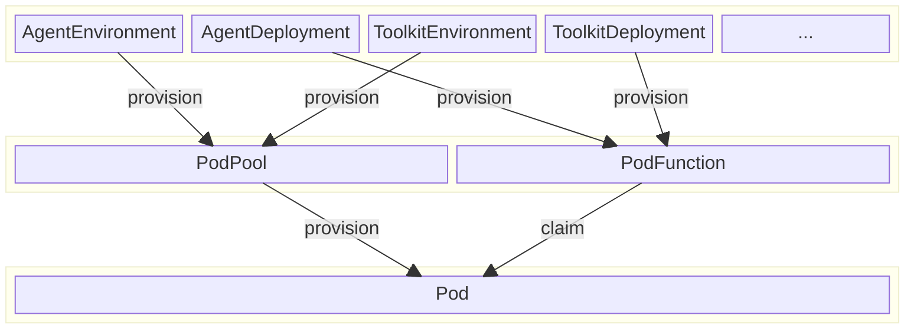

# tuna-fusion

`tuna-fusion` is an opensource cloud-native agent runtime frameworks.

## Why `tuna-fusion` matters

* Multi-agent deployment: In common practice, multiple agents are deployed to  fulfil a complex task. Unlike general web applications, different web routes are designed to decompose a complicated web application, a standalone agent is the minimum working unit to achieve this goal. And deployments of multiple agents brings up problems like build efficiency, deployment complexity, and resource management.
* Session isolation: Current agent execution involves risky actions like autonomous code evaluation and filesystem operations. The agent runtime should have session-level isolation in mind to make sure nobody make agent to delete files owned by others.
* Vertical integrations: A set of components including MCP tools, vector databases and prompt managements are needed for agents. Orchestration of these components is a challenge. Say, RBAC permission control of agents against MCP toolset, databases.

In the bottom line, we need a new runtime framework to make agentic applications to work in real world enterprise scenarios.

## `tuna-fusion`: a cloud-native approach for agent runtime

In `tuan-fusion`, we offer several Kubernetes CRDs (Custom resource definitions) to abstract components involved in agentic applications. 

* `AgentEnvironment` defines how we build the agent source code and boostrap the agent instance. Under the hood, `AgentEnvironment` provides `PodTemplate`s for the builder job resource and runtime deployment resource.
* `AgentDeployment` defines how a single agent behave. It contains the basic information like `AgentCard` and other configurations about A2A runtime.
* Similar to `AgentEnvironment`, `ToolkitEnviornment` defines how we build the toolkit source code and boostrap the tool instance.
* `ToolDeployment` defines a concrete tool instance. It contains the data schema for input and output and determines how the tool is executed, by invoking an existing HTTP API or running a piece of local code.

You may notice CRs about Agent and Tools would translate to `PodPool` and `PodFunction`. These two CRDs are key components in `tuna-fusion` to enable provisioning resources in serverless flavor. That is:

* You don't care about how cloud resources are allocated to agent instances, the system would handle it for you.
* Through Pod pooling, less resources are consumed when hosting a large collection of different agents. Pods are allocated just before the actual requests are received, and they are recycled after certain conditions are met.

## Getting started with `tuna-fusion`

* Installation: [Installation](installation.md)
* Dive deep into the design and architecture: 
  * [Concepts](concepts.md)
  * [Architecture](architecture.md)
* Explore code samples
  * Sample agent implementations: [tuna-headquarter/tuna-fusion-agent-samples](https://github.com/tuna-headquater/tuna-fusion-agent-samples)
* Learn how to contribute
  * [Code guidelines](contributor-guide/code-guidelines.md)
  * [Build and Test](contributor-guide/build-and-test.md)

## Community

* [GitHub discussion](https://github.com/tuna-headquater/tuna-fusion/discussions)
* [Discord server](https://discord.gg/SkQsFgdC)

