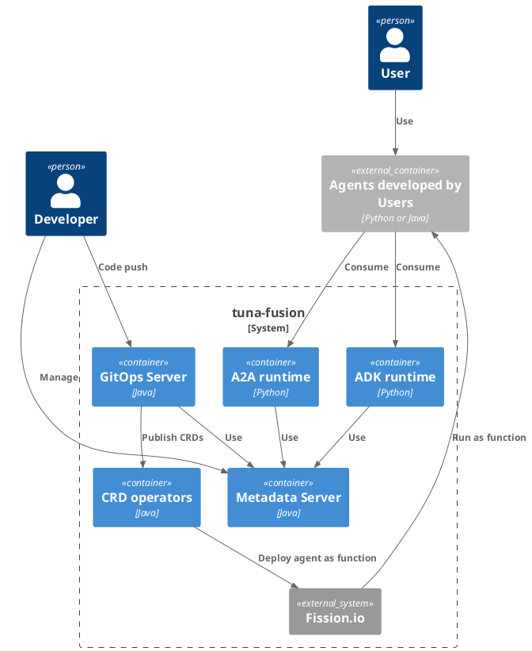
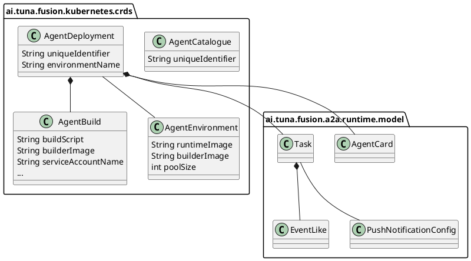

# Architecture

## Component Diagram

```plantuml
@startuml
!include <C4/C4_Container>
Person(dev, "Developer")
Person(user, "User")

System_Boundary(fusion, "tuna-fusion") {
    Container(a2a_runtime, "A2A runtime", "Python")
    Container(adk_runtime, "ADK runtime", "Python")
    Container(gitops, "GitOps Server", "Java")
    Container(metadata, "Metadata Server", "Java")
    Container(crd, "CRD operators", "Java")
    
    Rel(gitops, crd, "Publish CRDs")
    Rel(gitops, metadata, "Use")
    Rel(a2a_runtime, metadata, "Use")
    Rel(adk_runtime, metadata, "Use")
    
    System_Ext(faas, "Fission.io")
}


Container_Ext(agent, "Agents developed by Users", "Python or Java")

Rel(faas, "agent", "Run as function")
Rel(agent, a2a_runtime, "Consume")
Rel(agent, adk_runtime, "Consume")
Rel(dev, gitops, "Code push")
Rel(dev, metadata, "Manage")

Rel(user, agent, "Use")
Rel(crd, faas, "Deploy agent as function")


@enduml
```

## Domain models

```plantuml
@startuml
set namespaceSeparator none

'package ai.tuna.fusion.metadata.model {
'    class AgentCatalogue {
'        String uniqueName
'        String description
'    }
'    class Agent {
'        String uniqueName
'        String description
'    }
'    
'    class BuildRecipe {
'        String buildScript
'        String builderImage
'        String serviceAccountName
'        String environmentName
'    }
'    
'    class GitOptions {
'        String watchedBranchName
'    }
'    
'    AgentCatalogue o-- Agent
'     
'    Agent -- BuildRecipe
'    Agent -- GitOptions
'    
'}

package ai.tuna.fusion.kubernetes.crds {
    class AgentCatalogue {
        String uniqueIdentifier
    }
    class AgentDeployment {
        String uniqueIdentifier
        String environmentName
    }
    class AgentBuild {
        String buildScript
        String builderImage
        String serviceAccountName
        ...
    }
    class AgentEnvironment {
        String runtimeImage
        String builderImage
        int poolSize
    }
    AgentDeployment -- AgentEnvironment
    AgentDeployment *-- AgentBuild
}

package ai.tuna.fusion.a2a.runtime.model {

    class AgentCard
    class Task
    class EventLike
    class PushNotificationConfig
    
    
    Task *-- EventLike
    Task -- PushNotificationConfig 
}

AgentDeployment -- AgentCard
AgentDeployment *-- Task


@enduml
```