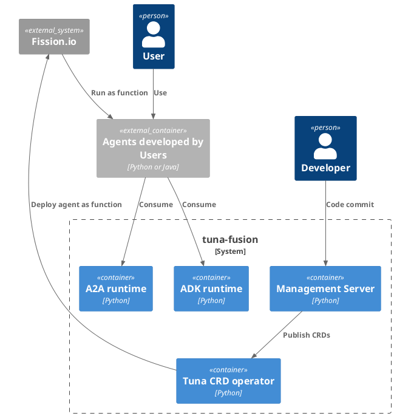

# Architecture

## Component Diagram

```plantuml
@startuml
!include <C4/C4_Container>
Person(dev, "Developer")
Person(user, "User")

System_Boundary(fusion, "tuna-fusion") {
    Container(a2a_runtime, "A2A runtime", "Python")
    Container(adk_runtime, "ADK runtime", "Python")
    Container(management_server, "Management Server", "Python")
    Container(crd, "Tuna CRD operator", "Python")
    
    Rel(management_server, crd, "Publish CRDs")
}

System_Ext(faas, "Fission.io")

Container_Ext(agent, "Agents developed by Users", "Python or Java")

Rel(faas, "agent", "Run as function")
Rel(agent, a2a_runtime, "Consume")
Rel(agent, adk_runtime, "Consume")
Rel(dev, management_server, "Code commit")

Rel(user, agent, "Use")
Rel(crd, faas, "Deploy agent as function")


@enduml
```